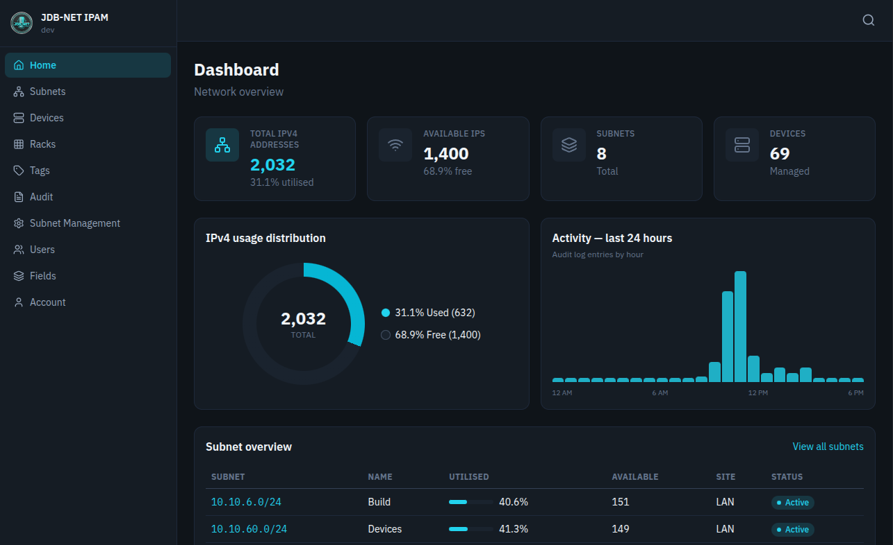

<div align="center">

  <h1>JDB-NET IPAM</h1>

  <p>Open source IP address management for homelabs, small businesses, and IT teams.</p>

  <p>
    <a href="https://github.com/jdbnet/ipam/blob/main/LICENSE">
      
    </a>
    <a href="https://cr.jdbnet.co.uk">
      
    </a>
  </p>

  <p>
    <a href="https://www.jdbnet.co.uk/products/ipam"><strong>☁️ Managed hosting from £8/month →</strong></a>
  </p>
</div>

---

Manage subnets, IP assignments, DHCP pools, devices, and rack layout from 
a single web interface. Built with Flask and Vue 3, deployable with a single 
Docker Compose file.



## Features

- **Subnet management** - CIDR subnets (/24–/32) with automatic IP generation
- **IP assignment** - Assign addresses to devices with hostname tracking and assignment history
- **DHCP pools** - Configure ranges and excluded IPs per subnet; pool addresses are kept out of manual assignment
- **Device management** - Names, descriptions, tags, custom fields, and bulk creation
- **Rack layout** - U positions with front/back face placement and non-networked entries
- **Site organisation** - Group subnets and devices by location for multi-site networks
- **Global search** - Press `/` to search subnets, IPs, devices, and racks from anywhere
- **Audit logging** - Filterable change history with CSV export
- **Role-based access control** - Granular permissions, custom roles, and enforced 2FA per role
- **REST API v2** - Full JSON API with session cookie and API key authentication
- **Custom fields** - Extend devices and subnets with admin-defined fields, no schema changes required
- **Organisation branding** - Set your name and logo from Settings or environment variables

## Quick start

```yaml
services:
  ipam:
    image: cr.jdbnet.co.uk/public/ipam:latest
    container_name: ipam
    restart: unless-stopped
    ports:
      - "5000:5000"
    environment:
      - MYSQL_HOST=your_db_host
      - MYSQL_USER=ipam
      - MYSQL_PASSWORD=your_password
      - MYSQL_DATABASE=ipam
      - SECRET_KEY=your_secret_key        # generate with: openssl rand -hex 32
```

A MySQL or MariaDB database is required. The schema is created automatically 
on first run. Log in with `admin@example.com` / `password` and change the password immediately.

## Environment variables

| Variable | Required | Description |
|----------|----------|-------------|
| `MYSQL_HOST` | Yes | Database host |
| `MYSQL_USER` | Yes | Database user |
| `MYSQL_PASSWORD` | Yes | Database password |
| `MYSQL_DATABASE` | Yes | Database name |
| `SECRET_KEY` | Yes | Flask secret key - use a long random string |

## Managed hosting

Don't want to run it yourself? JDB-NET offers fully managed hosting from 
**£8/month** - provisioned in under 10 minutes, no maintenance required.

[→ jdbnet.co.uk/products/ipam](https://www.jdbnet.co.uk/products/ipam)

## License

[MIT](LICENSE)